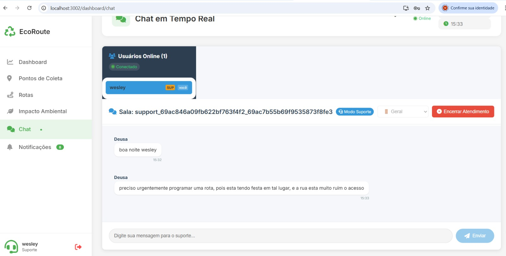

# 🌱 EcoRoute - Sistema de Logística Reversa para Otimização de Coleta de Recicláveis

<div align="center">


**Um sistema inteligente para otimizar a coleta de recicláveis e maximizar o impacto ambiental** ♻️

[Sobre](#sobre) • [Funcionalidades](#funcionalidades) • [Tecnologias](#tecnologias) • [Instalação](#instalação) • [Uso](#uso) • [Arquitetura](#arquitetura) • [Contribuidores](#contribuidores)

</div>

---

## 📋 Sobre

O **EcoRoute** é um sistema full-stack desenvolvido como projeto de faculdade para revolucionar a gestão da logística reversa. Ele permite que cooperativas e prefeituras gerenciem pontos de coleta de recicláveis, registrem coletas e gerem **rotas otimizadas** que economizam tempo, combustível e reduzem emissões de carbono.

Além disso, o sistema oferece um **painel de impacto ambiental** que traduz dados técnicos em métricas inspiradoras, mostrando quantas árvores foram preservadas, quanto de água foi economizado e quanto de energia foi poupada.

### 🎯 Objetivo Geral

Desenvolver uma solução digital que melhore a eficiência da coleta de resíduos recicláveis, reduzindo custos operacionais e ampliando o impacto ambiental positivo através de otimização de rotas e análise de dados.

---

## ✨ Funcionalidades Principais

### 🗺️ **Gestão de Pontos de Coleta**
- ✅ Cadastro de pontos de coleta com endereço, capacidade e coordenadas geográficas
- ✅ Registro e edição de informações detalhadas
- ✅ Classificação por tipos de resíduos aceitos
- ✅ Visualização em mapa interativo

### 📦 **Sistema de Registros de Coleta**
- ✅ Registro de coletas realizadas
- ✅ Validação automática de capacidade
- ✅ Atualização em tempo real do volume acumulado
- ✅ Histórico de coletas por ponto

### 🚗 **Otimização de Rotas**
- ✅ Algoritmo inteligente de cálculo de rotas mais eficientes
- ✅ Minimização de distância percorrida
- ✅ Redução de consumo de combustível
- ✅ Visualização de rotas em mapa

### 📊 **Dashboard Operacional**
- ✅ Métricas em tempo real
- ✅ Total de pontos cadastrados
- ✅ Rotas realizadas
- ✅ Volume total coletado
- ✅ Estimativa de CO₂ economizado

### 🌍 **Painel de Impacto Ambiental**
- ✅ Tradução de dados em indicadores visuais
- ✅ Árvores preservadas
- ✅ Água economizada (em litros)
- ✅ Energia economizada (em kWh)
- ✅ CO₂ evitado (em kg)

### 💬 **Chat em Tempo Real**
- ✅ Comunicação entre cooperativas e suporte
- ✅ Notificações de usuários online
- ✅ Sistema de salas por tipo de usuário
- ✅ Histórico de mensagens

### 🔐 **Segurança e Autenticação**
- ✅ Autenticação JWT (JSON Web Tokens)
- ✅ Criptografia de senhas com bcrypt
- ✅ Validação de dados em backend
- ✅ Tratamento adequado de erros
- ✅ Controle de acesso por perfil (Admin, Cooperativa, Prefeitura, Suporte)

---

## 🛠️ Tecnologias Utilizadas

### Frontend
- **React** - Biblioteca para construção de interfaces
- **React Router** - Roteamento entre páginas
- **Axios** - Cliente HTTP para requisições
- **Socket.IO Client** - Comunicação em tempo real
- **CSS3 / Styled Components** - Estilização responsiva

### Backend
- **Node.js** - Runtime JavaScript
- **Express.js** - Framework web
- **MongoDB** - Banco de dados NoSQL
- **Mongoose** - ODM (Object Document Mapper)
- **JWT (jsonwebtoken)** - Autenticação
- **bcryptjs** - Criptografia de senhas
- **Socket.IO** - Comunicação WebSocket em tempo real
- **Cors** - Controle de requisições entre origens
- **Dotenv** - Gerenciamento de variáveis de ambiente

### DevOps & Containerização
- **Docker** - Containerização da aplicação
- **Docker Compose** - Orquestração de containers

### Metodologia
- **Scrum** - Metodologia ágil de desenvolvimento
- **Git** - Controle de versão
- **GitHub** - Repositório do projeto

---

## 🚀 Como Começar

### Pré-requisitos

Antes de começar, certifique-se de ter instalado:
- [Node.js](https://nodejs.org/) (v14 ou superior)
- [MongoDB](https://www.mongodb.com/) (local ou Atlas)
- [Git](https://git-scm.com/)
- [Docker](https://www.docker.com/) (opcional, para containerização)

### Instalação

#### 1️⃣ Clone o repositório

```bash
git clone https://github.com/MoisesLimaJr/Sustentabilidade.git
cd Sustentabilidade
```

#### 2️⃣ Configure o Backend

```bash
cd backend

# Instale as dependências
npm install

# Crie um arquivo .env com as variáveis de ambiente
touch .env
```

**Exemplo de arquivo `.env`:**
```env
PORT=5000
MONGODB_URI=mongodb://localhost:27017/ecoroute
JWT_SECRET=sua_chave_secreta_aqui
NODE_ENV=development
```

#### 3️⃣ Configure o Frontend

```bash
cd ../frontend

# Instale as dependências
npm install

# Crie um arquivo .env com a URL da API
touch .env
```

**Exemplo de arquivo `.env`:**
```env
REACT_APP_API_URL=http://localhost:5000
```

### ⚙️ Executando o Projeto

#### Opção 1: Desenvolvimento Local

```bash
# Terminal 1 - Backend
cd backend
npm start

# Terminal 2 - Frontend
cd frontend
npm start
```

O aplicativo estará disponível em `http://localhost:3000`

#### Opção 2: Com Docker

```bash
# Na raiz do projeto
docker-compose up
```

---

## 📱 Interface da Aplicação

### Chat em Tempo Real


O sistema possui um chat integrado que permite comunicação em tempo real entre cooperativas, prefeituras e equipes de suporte.

**Funcionalidades:**
- Visualização de usuários online
- Salas específicas por tipo de usuário
- Notificações de entrada/saída
- Histórico de mensagens persistido

### Dashboard Operacional


Painel centralizado com todas as métricas operacionais importantes para tomada de decisão.

### Impacto Ambiental


Visualize de forma intuitiva o impacto positivo das coletas realizadas.

---

## 📸 Screenshots

### Chat em Tempo Real

O sistema inclui um chat robusto com comunicação em tempo real usando Socket.IO:

**Funcionalidades:**
- ✅ Mensagens em tempo real
- ✅ Visualização de usuários online
- ✅ Salas de chat organizadas por tipo de usuário
- ✅ Histórico de mensagens persistido
- ✅ Notificações de entrada/saída
- ✅ Status de usuários em tempo real



*Para mais screenshots e detalhes visuais, consulte [SCREENSHOTS.md](./SCREENSHOTS.md)*

---

## 🏗️ Arquitetura do Projeto

```
Sustentabilidade/
├── backend/
│   ├── src/
│   │   ├── models/          # Modelos MongoDB (User, Collection, Route, etc)
│   │   ├── routes/          # Rotas da API
│   │   ├── controllers/      # Lógica de negócio
│   │   ├── middleware/       # Autenticação, validação
│   │   └── utils/           # Funções auxiliares (criptografia, otimização)
│   ├── .env                 # Variáveis de ambiente
│   └── package.json
│
├── frontend/
│   ├── src/
│   │   ├── components/      # Componentes React reutilizáveis
│   │   ├── pages/          # Páginas da aplicação
│   │   ├── services/       # Serviços (API, WebSocket)
│   │   ├── styles/         # Estilos globais
│   │   └── App.js
│   ├── .env                # Variáveis de ambiente
│   └── package.json
│
├── docker-compose.yml      # Orquestração de containers
└── README.md
```

---

## 🔗 Endpoints da API

### Autenticação
```http
POST   /api/auth/register       # Registrar novo usuário
POST   /api/auth/login          # Fazer login
POST   /api/auth/logout         # Fazer logout
```

### Pontos de Coleta
```http
GET    /api/collection-points   # Listar todos os pontos
POST   /api/collection-points   # Criar novo ponto
GET    /api/collection-points/:id
PUT    /api/collection-points/:id
DELETE /api/collection-points/:id
```

### Coletas
```http
GET    /api/collections         # Listar coletas
POST   /api/collections         # Registrar nova coleta
GET    /api/collections/:id
```

### Rotas
```http
GET    /api/routes              # Listar rotas
POST   /api/routes/optimize     # Gerar rota otimizada
GET    /api/routes/:id
```

### Dashboard
```http
GET    /api/dashboard/metrics   # Métricas operacionais
GET    /api/dashboard/impact    # Impacto ambiental
```

---

## 🧪 Testes

Para executar testes (quando implementados):

```bash
npm test
```

---

## 🌟 Diferenciais do Projeto

- 🎯 **Algoritmo de Otimização Inteligente**: Calcula rotas mais eficientes economizando combustível
- 🌍 **Impacto Ambiental Visualizado**: Transforma dados técnicos em métricas inspiradoras
- 💬 **Comunicação em Tempo Real**: Sistema de chat WebSocket integrado
- 🔐 **Segurança Robusta**: JWT + bcrypt + validações
- 📱 **Interface Responsiva**: Funciona em desktop e mobile
- 🐳 **Containerizado**: Pronto para produção com Docker
- ♻️ **Escalável e Modular**: Código bem estruturado e documentado

---

## 📊 Metodologia de Desenvolvimento

O projeto segue a **metodologia Scrum** com:
- ✅ Sprints de 2 semanas
- ✅ Daily standups
- ✅ Revisão de sprint
- ✅ Retrospectivas
- ✅ Product backlog organizado

---

# 👥 Contribuidores - EcoRoute

<div align="center">

## Time de Desenvolvimento

Conheça o time que desenvolveu o EcoRoute!

</div>

---

<table>
  <tr>
    <td align="center" width="50%">
      <a href="https://github.com/Wesleytech22">
        
      </a>
      <br />
      <h3><b>Wesley Dias</b></h3>
      <p><strong>Backend Developer</strong></p>
      <p>
        <a href="https://github.com/Wesleytech22">
          
        </a>
        <a href="https://linkedin.com/in/wesley-dias">
          
        </a>
      </p>
    </td>
    <td align="center" width="50%">
      <a href="https://github.com/MoisesLimaJr">
        
      </a>
      <br />
      <h3><b>Moises Lima Jr</b></h3>
      <p><strong>Full Stack Developer</strong></p>
      <p>
        <a href="https://github.com/MoisesLimaJr">
          
        </a>
        <a href="https://linkedin.com/in/moises-lima">
          
        </a>
      </p>
    </td>
  </tr>
</table>

---

## 🎓 Sobre o Projeto

Este projeto foi desenvolvido como trabalho de faculdade na metodologia **Scrum**, integrando desenvolvimento frontend e backend para criar uma solução completa de logística reversa.

### 📊 Contribuições

- **Wesley Dias**: Arquitetura backend, APIs REST, Socket.IO, Autenticação
- **Moises Lima Jr**: Interface React, Integração frontend-backend, Deploy

---

## 🤝 Como Contribuir

Se você deseja contribuir com o projeto EcoRoute:

1. Faça um **Fork** do repositório
2. Crie uma **branch** para sua feature (`git checkout -b feature/AmazingFeature`)
3. **Commit** suas mudanças (`git commit -m 'Add AmazingFeature'`)
4. **Push** para a branch (`git push origin feature/AmazingFeature`)
5. Abra um **Pull Request**

---

## 📝 Código de Conduta

Este projeto adota um código de conduta para garantir um ambiente inclusivo e respeitoso. Leia mais em [CODE_OF_CONDUCT.md](./CODE_OF_CONDUCT.md).

---

## 📞 Contato

- **GitHub Issues**: [Abra uma issue](https://github.com/MoisesLimaJr/Sustentabilidade/issues)
- **Discussões**: [Veja as discussões do projeto](https://github.com/MoisesLimaJr/Sustentabilidade/discussions)

---

**Desenvolvido com ❤️ pelo time EcoRoute | 2026**


---

## 📝 Licença

Este projeto é licenciado sob a Licença MIT - veja o arquivo [LICENSE](LICENSE) para detalhes.

---

## 🤝 Como Contribuir

1. Fork o projeto
2. Crie uma branch para sua feature (`git checkout -b feature/AmazingFeature`)
3. Commit suas mudanças (`git commit -m 'Add some AmazingFeature'`)
4. Push para a branch (`git push origin feature/AmazingFeature`)
5. Abra um Pull Request

---

## 📞 Contato & Suporte

Para dúvidas ou sugestões sobre o projeto:

- **GitHub**: [MoisesLimaJr](https://github.com/MoisesLimaJr)
- **Issues**: [Abra uma issue](https://github.com/MoisesLimaJr/Sustentabilidade/issues)

---

## 📚 Referências e Recursos

- [Node.js Documentation](https://nodejs.org/docs/)
- [React Documentation](https://react.dev/)
- [MongoDB Manual](https://docs.mongodb.com/manual/)
- [Express.js Guide](https://expressjs.com/)
- [Socket.IO Documentation](https://socket.io/docs/)
- [JWT Best Practices](https://tools.ietf.org/html/rfc7519)

---

<div align="center">

**Desenvolvido com ❤️ e 🌱 pelo time EcoRoute**

Último update: Abril de 2026

</div>
