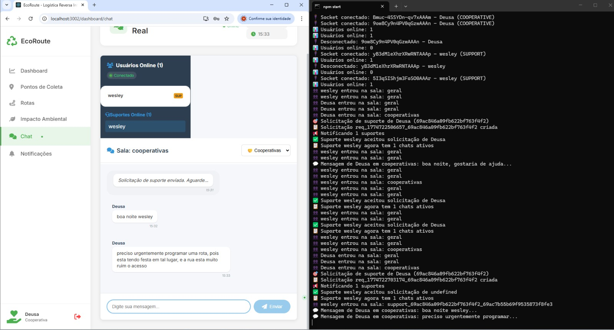

# 📸 Screenshots - EcoRoute

Veja a interface do sistema EcoRoute em ação!

---

## 🏠 Interface Principal

### Navegação Lateral
A navegação lateral permite acesso rápido a todas as funcionalidades do sistema:

- **Dashboard** - Visualize métricas operacionais em tempo real
- **Pontos de Coleta** - Gerencie pontos de coleta com mapa interativo
- **Rotas** - Visualize e otimize rotas de coleta
- **Impacto Ambiental** - Acompanhe o impacto positivo das coletas
- **Chat** - Comunicação em tempo real com outras equipes
- **Notificações** - Receba atualizações importantes

---

## 💬 Chat em Tempo Real

### Visualização Geral da Interface de Chat


**Funcionalidades visíveis:**
- ✅ Barra lateral com menu de navegação
- ✅ Seção de usuários online
- ✅ Histórico de mensagens
- ✅ Campo de entrada de mensagens
- ✅ Status de usuários (Conectado/Desconectado)
- ✅ Salas de suporte categorizadas

**Características implementadas:**
- 💬 Mensagens em tempo real com Socket.IO
- 👥 Visualização de usuários online
- 🏷️ Salas separadas por tipo de usuário (Cooperativas, Suporte)
- ⏰ Timestamps nas mensagens
- 🔔 Notificações de entrada/saída de usuários

---

### Detalhe: Usuários Online



**Mostra:**
- Número de usuários conectados
- Nome de cada usuário
- Status (verde = conectado)
- Funções do usuário (SUP = Suporte, COOP = Cooperativa)

**Funcionalidades:**
- Atualização em tempo real
- Indicador visual de status
- Identificação de papéis de usuário

---

### Detalhe: Sala de Suporte


**Mostra:**
- Nome da sala de suporte
- Modo de atendimento
- Histórico de conversas
- Campo para digitar novas mensagens
- Botão de envio

**Funcionalidades:**
- Salas organizadas por tipo
- Histórico persistido
- Modo suporte ativo
- Integração com usuários online

---

## 📊 Dashboard (Em Desenvolvimento)

*Screenshots do dashboard em breve!*

Funcionalidades esperadas:
- 📈 Gráficos de coletas por período
- 📍 Mapa com localização de pontos
- 🚗 Número de rotas realizadas
- 📦 Volume total coletado
- 🌍 Estimativa de impacto ambiental
- 📲 Alertas e notificações

---

## 🗺️ Pontos de Coleta (Em Desenvolvimento)

*Screenshots da página de pontos em breve!*

Funcionalidades esperadas:
- 📍 Mapa interativo com marcadores
- 📋 Lista de pontos cadastrados
- ✏️ Formulário para adicionar/editar pontos
- 🔍 Busca e filtros
- 📊 Informações detalhadas por ponto

---

## 🚗 Rotas Otimizadas (Em Desenvolvimento)

*Screenshots das rotas em breve!*

Funcionalidades esperadas:
- 🗺️ Visualização de rotas no mapa
- 📍 Sequência de pontos de coleta
- ⏱️ Tempo estimado
- ⛽ Combustível estimado
- 📊 Estatísticas da rota

---

## 🌍 Impacto Ambiental (Em Desenvolvimento)

*Screenshots do painel de impacto em breve!*

Funcionalidades esperadas:
- 🌳 Árvores preservadas
- 💧 Litros de água economizada
- ⚡ kWh de energia economizada
- 🌫️ kg de CO₂ evitado
- 📈 Gráficos de evolução
- 🏆 Metas e rankings

---

## 🔐 Autenticação e Login (Em Desenvolvimento)

*Screenshots da tela de login em breve!*

Funcionalidades esperadas:
- 📧 Campo de email
- 🔒 Campo de senha
- 🔑 Autenticação JWT
- 📝 Opção de registrar novo usuário
- 🔄 Recuperar senha

---

## 📱 Responsividade

O EcoRoute é totalmente responsivo e funciona em:
- 🖥️ Desktop (1920px+)
- 💻 Laptop (1366px+)
- 📱 Tablet (768px+)
- 📲 Mobile (320px+)

*Screenshots mobile em breve!*

---

## 🎨 Design e Paleta de Cores

### Cores Principais
- **Verde Primário** (#00A86B) - Sustentabilidade e vida
- **Azul Secundário** (#0066CC) - Confiança e profissionalismo
- **Cinza Neutro** (#F5F5F5) - Backgrounds limpos
- **Vermelho de Ação** (#DC143C) - Botões críticos

### Componentes Reutilizáveis
- Buttons customizados
- Cards informativos
- Modals para ações importantes
- Badges de status
- Navbars responsivas

---

## 📈 Próximas Atualizações

Conforme o projeto avança, mais screenshots serão adicionados para:

- [x] Chat em Tempo Real
- [ ] Dashboard Operacional
- [ ] Gestão de Pontos de Coleta
- [ ] Otimização de Rotas
- [ ] Painel de Impacto Ambiental
- [ ] Telas Mobile
- [ ] Dark Mode (futuro)

---

## 💡 Como Tirar Bons Screenshots

Se quiser adicionar mais screenshots ao projeto:

1. **Use resolução adequada** - Mínimo 1366x768
2. **Limpe a interface** - Remova dados sensíveis
3. **Use dados realistas** - Não use textos genéricos
4. **Capture funcionalidades** - Mostre o que faz
5. **Padronize nomes** - Use convenção: `feature-description.png`
6. **Comprima as imagens** - Use ferramentas como TinyPNG

---

## 📂 Estrutura de Pastas para Screenshots

```
Sustentabilidade/
├── README.md
├── screenshots/
│   ├── chat-interface.png
│   ├── chat-users-online.png
│   ├── chat-support-room.png
│   ├── dashboard-main.png (futuro)
│   ├── collection-points-map.png (futuro)
│   ├── routes-optimization.png (futuro)
│   └── environmental-impact.png (futuro)
└── docs/
```

---

## 🚀 Integração com o README

No arquivo **README.md** principal, adicione após a seção de Funcionalidades:

```markdown
## 📸 Screenshots

Veja a interface do EcoRoute em ação:

### Chat em Tempo Real


### Dashboard Operacional


*Para mais screenshots, veja [SCREENSHOTS.md](./SCREENSHOTS.md)*
```

---

## 📝 Notas Importantes

- Atualize os screenshots quando fizer mudanças visuais significativas
- Mantenha a pasta `screenshots/` organizada
- Use nomes descritivos para os arquivos
- Documente novas features com screenshots
- Considere criar GIFs para features dinâmicas (chat, rotas)

---

**Última atualização:** Abril de 2026
**Status:** 1 de 7 telas documentadas (14%)

